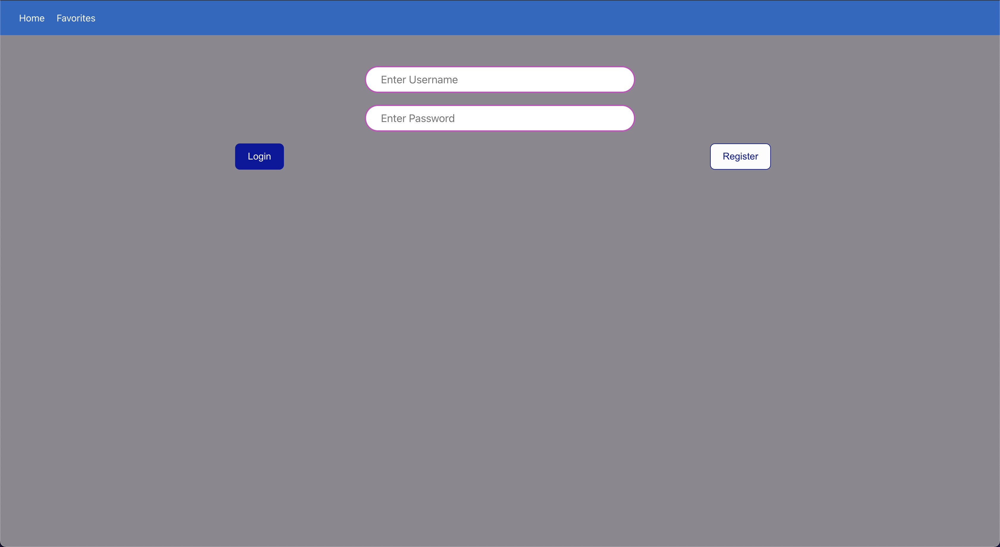
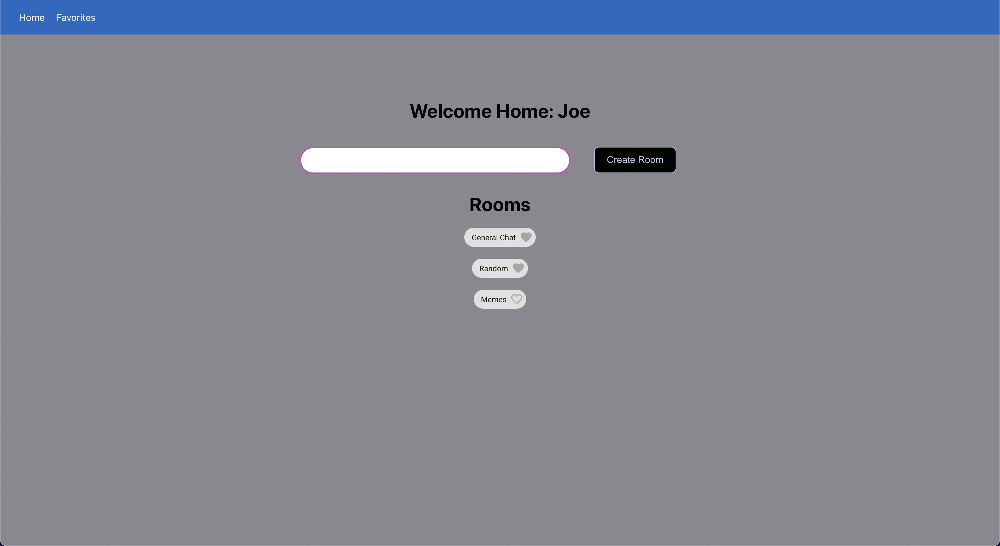
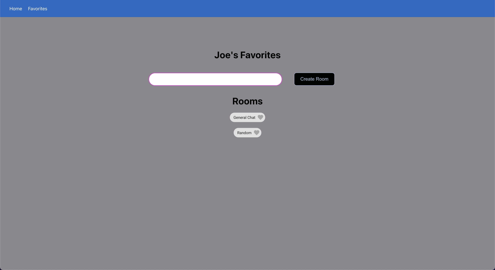
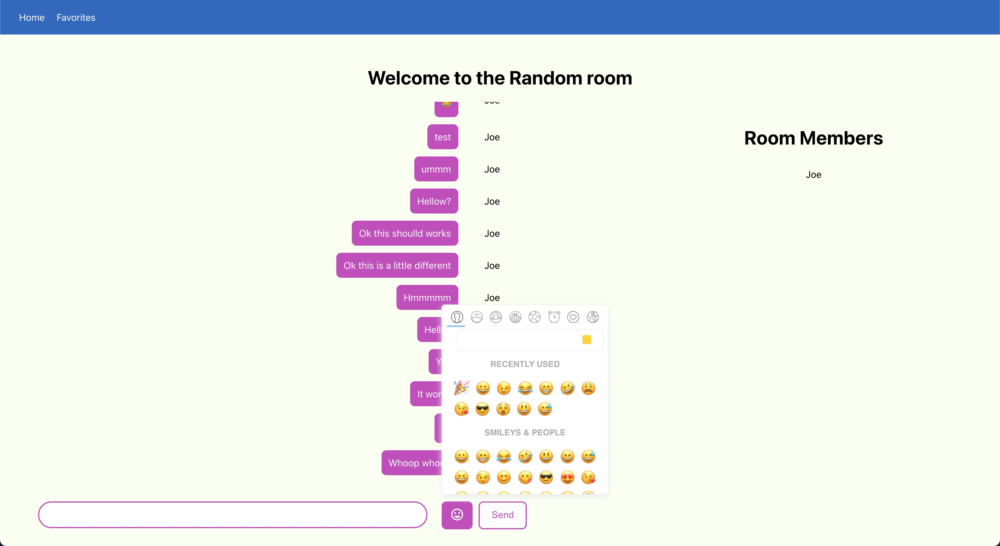

# Chat Room App

This API was built to support the [chat_app_FE](https://github.com/jmoussa/chat_app_FE).
In the `/api` folder you will find the routes for rooms and users.
This being a FastAPI app, you will also be able to get quick documenatation on the routes and request types after running.

This app uses:

- Anaconda (for Python environemnt management)
- Python FastAPI+WebSockets [docs](https://fastapi.tiangolo.com/)
- Pymongo [docs](https://pymongo.readthedocs.io/en/stable/)
- MongoDB [docs](https://docs.mongodb.com/manual/)
- AWS S3


## Setting up and running

I've set it up so that you only need to use the `run` script to start.
Be sure to set the S3 environement variables for access

```bash
conda env create -f environment.yml
conda activate chat_app
export AWS_SECRET_ACCESS_KEY=...
export AWS_ACCESS_KEY_ID=...
cp config.template.py config.py # and enter your configuration parameters
./run
```

_For quick API documentation, navigate to `localhost:8000/docs` after starting the server_

## Screenshots




